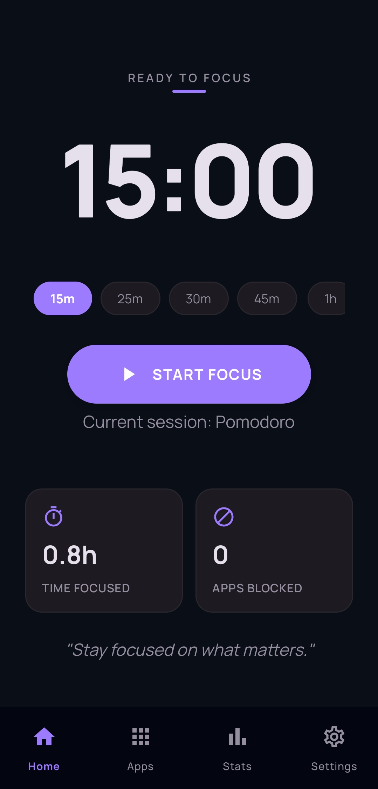
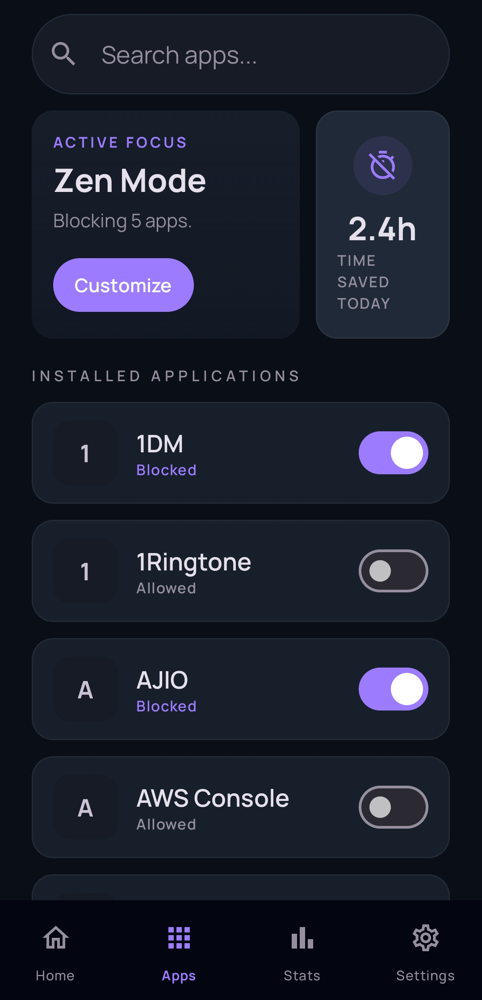
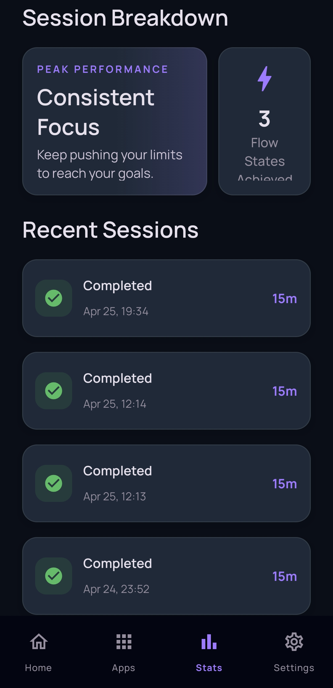
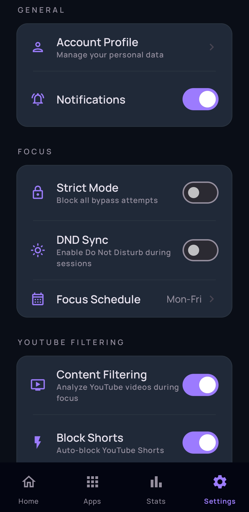
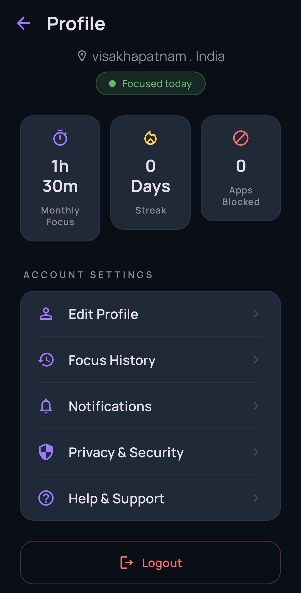

# 🛡️ FocusGuard (Zenlock)

A powerful, privacy-first Android application designed to help you reclaim your time and stay focused by blocking distracting apps and automatically filtering out unproductive YouTube content.

## 📸 Screenshots

  
  
  
  
  

## ✨ Core Features

### 🚀 App Blocking Engine
- **Global App Blocking**: Select any installed app to be blocked during a focus session.
- **Persistent Overlay**: Uses a custom Jetpack Compose `SYSTEM_ALERT_WINDOW` overlay to block access to apps in real-time.
- **Auto-Redirect**: If you attempt to open a blocked app, the app instantly shows the block screen and redirects you to your device's home screen when you click "Go Back to Work".

### 📺 Advanced YouTube Content Filtering
- **Shorts Blocker**: Automatically detects when you open the YouTube Shorts player or tab and instantly blocks it (sends you one step back to where you were).
- **Smart Video Classification**: Scans YouTube watch pages in real-time using Accessibility Services to extract video titles and on-screen text.
- **Custom Keyword Engine**: Maintain your own lists of "Allowed" (educational) and "Blocked" (distracting) keywords. 
- **Safe Browsing**: Specifically designed to *only* evaluate content when you actively open a video player. You can browse your YouTube Home feed, Search, and Subscriptions completely freely without being falsely blocked by video thumbnails.
- **Strict Unknown Content Blocking**: Option to automatically block any video that doesn't explicitly match your "Allow" list.

### ⏱️ Pomodoro & Focus Timer
- **Foreground Service Architecture**: Your timer is completely decoupled from the UI. It survives app restarts, swipes from recents, and memory sweeps.
- **State Recovery**: Seamlessly reconnects to the active focus session stored securely in the local Room database even if the app process is fully killed.
- **Live UI Updates**: The beautiful Jetpack Compose home screen polls the foreground service to show a pulsating timer ring and live updates of how many distractions have been blocked in real-time.
- **Strict Mode**: Prevent yourself from giving up! When Strict Mode is enabled in settings, the "Pause" and "Stop" buttons are completely disabled during an active session.

### 📊 Statistics & Analytics
- **Local Database**: All sessions, keywords, and app block configurations are saved offline using Jetpack Room.
- **Weekly Charts**: Visualize your focus habits with a dynamic bar chart.
- **Session History**: Review past sessions, total focus times, and exactly how many distraction attempts were successfully blocked.

## 🔒 Privacy First
- **No Cloud Required**: 100% of the YouTube text classification, app blocking, and timer logic runs locally on your device.
- **No API Keys**: We don't use the YouTube API, meaning no quota limits and no data sent to Google.
- **Accessibility Service**: Used strictly to read the text of the *currently active window* for classification purposes only.

## 🛠️ Architecture
- **Language**: Kotlin
- **UI Toolkit**: Jetpack Compose (Material 3)
- **Architecture**: MVVM (Model-View-ViewModel)
- **Database**: Room
- **Preferences**: DataStore
- **Concurrency**: Kotlin Coroutines & Flow
- **Background**: Android Foreground Services

## 📋 Future Enhancements
- [ ] Whitelist specific YouTube channels
- [ ] Break timer with Pomodoro cycles
- [ ] App usage time statistics
- [ ] Widget for quick session start
- [ ] Schedule focus sessions automatically
